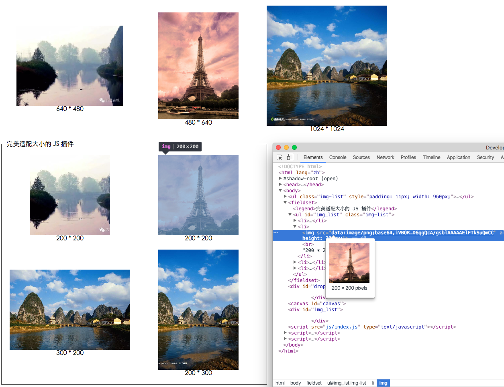

# ImageAdapt
&lt;img/> 图片大小适配显示插件

> 注意: 如果你的网站已经做到获得的静态资源文件和所显示的大小几乎一致，那此篇文件的实用性就为0。
> 不过你可以看一下其中的裁剪算法^_^

## 应用场景

在项目开发中，经常会听到 UI 说，这个地方的图片要等比缩放充满这个框显示，要是多了就裁剪显示。

一般会用到以下方法搞定之

### 图片以背景图显示 + 
~~~css
    background-size: cover / contain;
    background-position: center;
~~~

### “完美”适配解决方法

本着将工作做到极致的追求，着到图片各种被缩放或很多情况下背景图显示的不优雅，于是笔者在之前写得一个上传插件中提取了现在这个插件。

以上方法虽然能解决需求，但是在页面优化原则中，有一条在移动端页面中效果非常明显
> 图片最好显示原始大小，不要用大图进行缩放，尤其是非等比缩放。   

尤其是在图片多的情况下，图片的放缩会引起页面重绘，严重损耗页面的渲染性能，如果是在一个可以上下滑动的列表中，卡顿很明显。

为此，笔者写了一个通过 canvas 缩放裁剪图片的小插件，使之以等比/等大小的“完美”状态显示在页面中。还自带图片延迟加载功能。

效果图：

## 插件原理

1. 先是获取页面整个（或是指定部分）的 `IMG` 标签
2. 再根据配置指定的属性获得原图片 URL
3. 将原图片加载到 Image 对象中
4. **进行类似 CSS3 `background-size` 的 cover/contain 算法，算出图片的裁剪坐标(cover 模式)、canvas 绘制坐标(contain 模式)、缩放比例** （重点）
5. 利用 `canvas.drawImage` 方法，将图片缩放并裁剪后画入 canvas
6. `toDataURL` 导出最终图片的 base64 码，放入 `img` 标签

## 插件使用方法

`new ImageAdapt(selector[, options]);`

~~~javascript
var imgAdept = new ImageAdapt('#img_list', {
        type: 'cover',          // conver/contain 
        size: 'auto',           // 'auto' [300, 200] 
        imgSlt: 'img',          // IMG 标签选择符
        orignImg: 'orign',      // 原图 url 属性
        times: 1,               // N倍图
        bgColor: '#eee'         // 背景图颜色，contain 模式时做填充用
    });
imgAdept.init();
~~~

### selector

使用此插件的区域选择符/DOM元素，`'body'` 为全部页面 `img` 标签，也可为区域 dom 对象。

### options 选项

`type` 显示模式，默认 cover。cover：铺满；contain：包含

`size` 图片显示尺寸，默认 `auto`。`auto` 自行获取样式定义大小；`[width, height]` 配置宽高

`imgSlt` img 标签选择符，默认 `img`。

`orignImg` img 标签中获取原图 URL 的属性，默认 `orignImg`。注意，此属性符合 h5 `dataset` 自定义属性规则，在实际页面`img`中此属性记得加上 `data-`。

`times` X 倍图，默认为 `1`。 在移动端中可在配置 2、3。

`bgColor` contain 模式时，用于填充背景的颜色，默认`#eee`。

> 此插件支持 AMD、CMD 加载

## 注意事项

线上站点的静态资源文件基本都与业务主站点域名分开，域名不一致。对此，记得在资源站点 `response` 里加上 `Access-Control-Allow-Origin: *`，允许跨域操作。
至少允许主站域名可以跨域操作。

